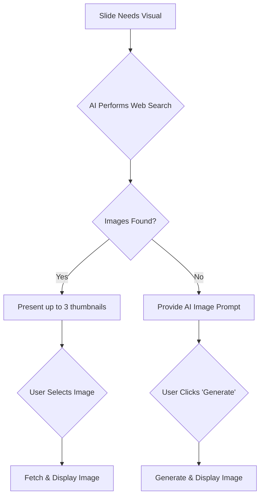

# 4.4. Step 3: Slide Generation & Editing

*   **F-SE-01:** The AI generates a complete set of slides based on the approved outline, selected tone, and template.
    *   Each slide contains a title and a list of bullet points.
*   **F-SE-01a (Generation Progress View):** During initial slide generation, a detailed progress screen is displayed. It shows the current stage (e.g., Researching, Creating Slides), sub-steps, key statistics (e.g., sources analyzed, slides created), and an estimated time to completion.
*   **F-SE-02 (UI Layout):** The slide editor displays a list of slide thumbnails in a sidebar for easy navigation and a large detail view for the currently selected slide.
*   **F-SE-03 (AI-Powered Text Editing):** Users can issue a natural language prompt to modify a slide's content (e.g., "Simplify the second bullet point", "change the image to a picture of a sunset"). The AI can also populate content for specialized layouts, for instance, by responding to prompts like "Add a subtitle: 'Q3 Financial Results'" or "Change this slide to be a quote from Albert Einstein". A visual change request will trigger a new image search (see F-SE-07d).
*   **F-SE-04 (Speaker Notes):** Users can ask the AI to generate speaker notes for any slide.
    *   The "Generate Notes" button will show a loading state and be disabled while the AI is processing.
*   **F-SE-05 (Key Takeaway):** Users can ask the AI to generate a single, concise key takeaway for any slide.
    *   The "Key Takeaway" button will show a loading state and be disabled while the AI is processing.
*   **F-SE-06 (Slide Expansion):** Users can ask the AI to expand a single slide into 2-3 new, more detailed slides.
    *   The "Expand Slide" button will show a loading state and be disabled while the AI is processing.
*   **F-SE-07 (Image Sourcing & Generation):**
    *   **F-SE-07a (Web Search Suggestions):** For each slide requiring a visual, the AI performs a web search and presents up to three relevant, royalty-free image options. These are displayed as interactive thumbnails within the slide's image area.
    *   **F-SE-07b (User Selection):** The user can click on their preferred image thumbnail. The application will then fetch the full-resolution image, convert it, and display it on the slide. A loading state is shown on the image area during this process.
    *   **F-SE-07c (AI Generation Fallback):** If the AI cannot find suitable images from its web search, it will instead provide a descriptive text prompt for an AI image generator. This prompt is displayed with a "Generate Image" button, allowing the user to create a visual on-demand.
    *   **F-SE-07d (Editing Flow):** When a user requests to change a slide's image via a natural language prompt (e.g., "find a picture of a cat"), the AI will provide a new set of image search results for the user to select from.

**Workflow for F-SE-07:**

*   **F-SE-08 (Slide Layout/Style):** Users can change the layout of a slide via a modal selector. Available layouts include standard formats (e.g., Image Left, Image Right, Title Only) as well as specialized, visually distinct layouts such as 'Section Header' (title and subtitle), 'Main Point Emphasis' (highlights a key statistic or phrase), and 'Quote' (showcases a quote with attribution).
*   **F-SE-09 (Fact-Checking):**
    *   Users can trigger an AI-powered fact-check for any individual slide. The "Fact Check" button will show a loading state and be disabled during this process.
    *   The AI uses Google Search to verify the information on the slide for accuracy and timeliness.
    *   The results are presented in a modal view, showing a side-by-side comparison of the original content and the AI's suggested, fact-checked version.
    *   The modal includes a summary explaining the changes made by the AI.
    *   Users have the option to accept and apply the suggested changes or discard them.
*   **F-SE-10 (Slide Reordering):** Users can change the order of slides by dragging and dropping the slide thumbnails in the navigation sidebar. The new order is saved automatically.
*   **F-SE-11 (AI-Powered Chart Generation):** Users can request data visualizations through natural language prompts (e.g., "create a bar chart of our quarterly sales"). The AI generates the necessary structured data (chart type, data points, labels, colors), which the application then renders as a visual chart on the slide, replacing the standard bullet points.
*   **F-SE-12 (AI Design Suggestions):** Users can request creative ideas for a slide's design.
    *   The "Suggest Ideas" button captures the current visual state of the slide as an image.
    *   This image, along with the slide's text content, is sent to a multimodal AI for analysis.
    *   The AI provides a critique and a list of actionable visual improvement ideas, which are displayed to the user in a modal.